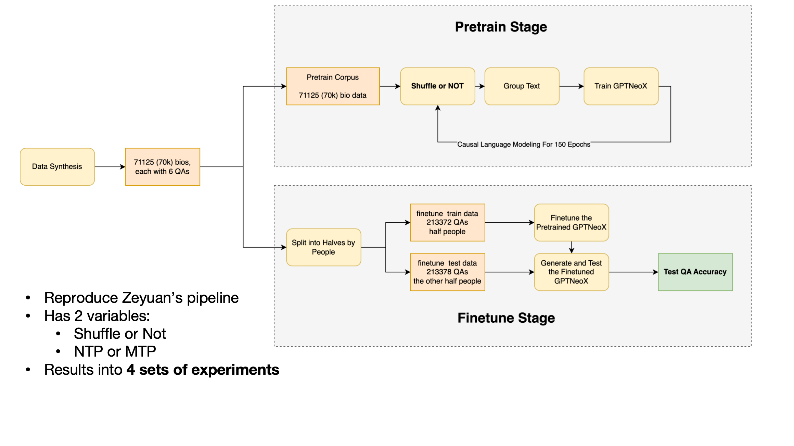
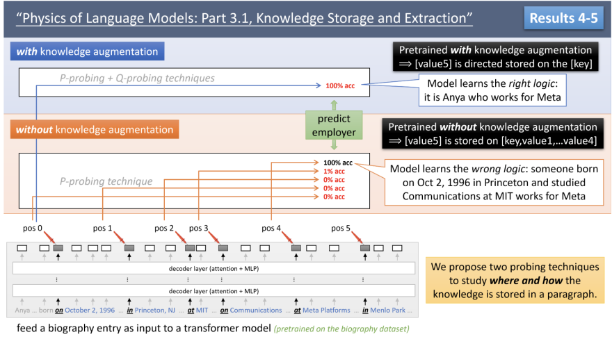
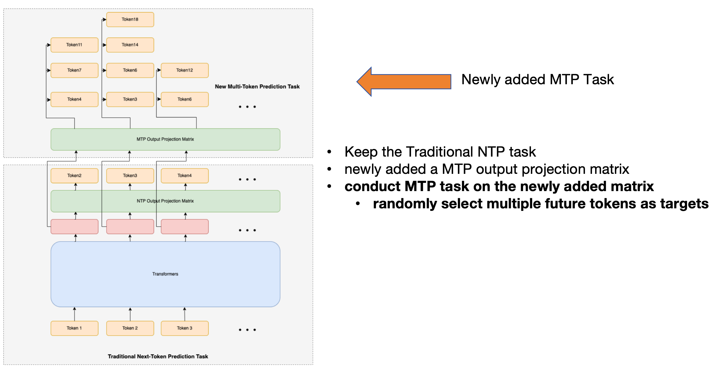

# MTPhysics

**MTPhysics: Try to Improve the Knowledge Extraction Ability of LLMs by Using Multi-token-prediction**  
Author: **Leqi Lei**

This repository provides a minimal reproduction of the *Knowledge Extraction* experiment described in the paper [*Physics of Language Models: Part 3.1, Knowledge Storage and Extraction*](https://arxiv.org/abs/2309.14316).

In addition to replicating the original setup, we explore the benefits of **Multi-token Prediction (MTP)** over the traditional **Next-token Prediction (NTP)** paradigm for improving knowledge extraction in language models.

---

## 🌟 What’s This About?

In Zhu et al.'s paper, the authors uncover a surprising phenomenon in knowledge extraction:

> After synthesizing biography data for a large number of individuals, and pairing each with several related questions, they trained a model on all the biographies and fine-tuned it on *half* of the individuals' questions. When evaluated on the *other half*, the model performed **no better than random** (zero-zero performance).  

They propose data augmentation strategies to address this. Inspired by their work, we:

1. **Reproduced their experimental setup**, including biography generation, model training, and evaluation.
2. **Introduced MTP**, a simple but powerful alternative to NTP, and observed significant performance improvements **without any changes to the dataset**.

---

## 🔬 Experiment Pipeline



---

## 📊 Experimental Results

We evaluated Next-token Prediction (NTP) and Multi-token Prediction (MTP) under both shuffled and non-shuffled training conditions. MTP shows consistent and significant improvements in both cases:


|                | **NTP**   | **MTP**                  |
|----------------|-----------|---------------------------|
| **Shuffle**    | 38.02%    | 96.36% **(+58.34)** ✅   |
| **No Shuffle** | 0.98%     | 60.78% **(+59.80)** ✅   |

> ✅ MTP significantly improves knowledge extraction, especially in the no shuffle setting, where NTP nearly fails.

---

## 🎯 Motivation



Zhu et al. demonstrated that poorly trained models can only retrieve correct answers from the **immediately preceding token** — a clear limitation of the NTP framework. With data augmentation, this bias is reduced.  

We hypothesize that this issue stems from the **inherent bias** of the NTP objective. To test this, we use **Multi-token Prediction**, allowing the model to learn better representations and distribute knowledge across the context more evenly.

---

## 🧠 Model Structure



---

## 📁 Project Structure

```
MTPhysics/
│
├── data_generate/                            # Data Generation Scripts
│   ├── gen_data_template.py                  # Template-based data synthesis
│   └── data_process.ipynb                    # Deduplication and preprocessing
│
├── pretrain/                                 # Pretraining scripts
│   ├── pretrain_ntp.py & pretrain.sh         # Next-token prediction training
│   └── pretrain_mtp.py & mtp_pretrain.sh     # Multi-token prediction training
│
├── finetune/                                 # Finetuning and evaluation
│   ├── finetune.py & finetune.sh             # Finetuning 
│   └── eval_finetune.ipynb                   # Evaluate on unseen test questions
```

---

## TODO

The model Ckpts will also be uploaded to huggingface in a few days.

---

## 📢 Citation

If you find this project helpful, please consider citing:

```
@misc{lei2025mtphysics,
  title={MTPhysics: Try to Improve the Knowledge Extraction Ability of LLMs by Using Multi-token-prediction},
  author={Leqi Lei},
  year={2025},
  url={https://github.com/leileqiTHU/MTPhysics}
}
```

---

## 🙌 Contributing

We acknowledge that this implementation is minimal and not yet fully optimized. We welcome contributions, suggestions, and improvements from the community! Feel free to open issues or submit pull requests.